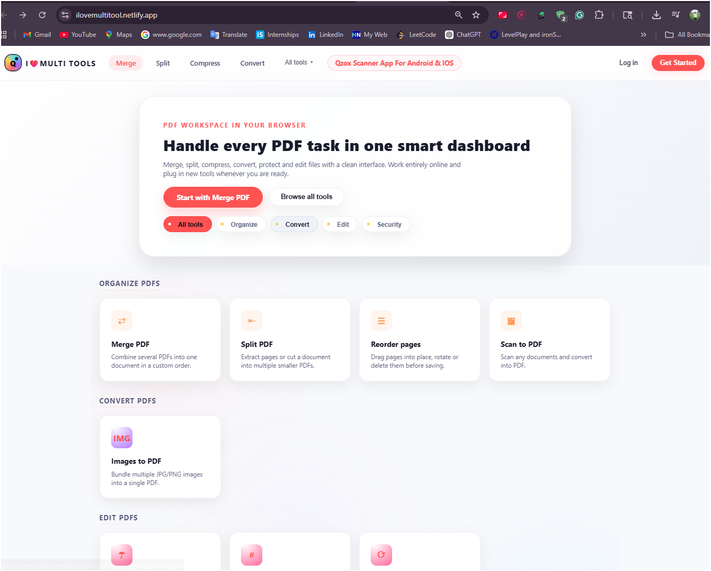
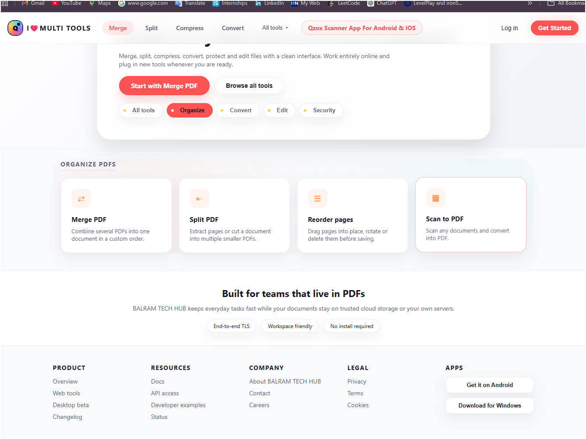
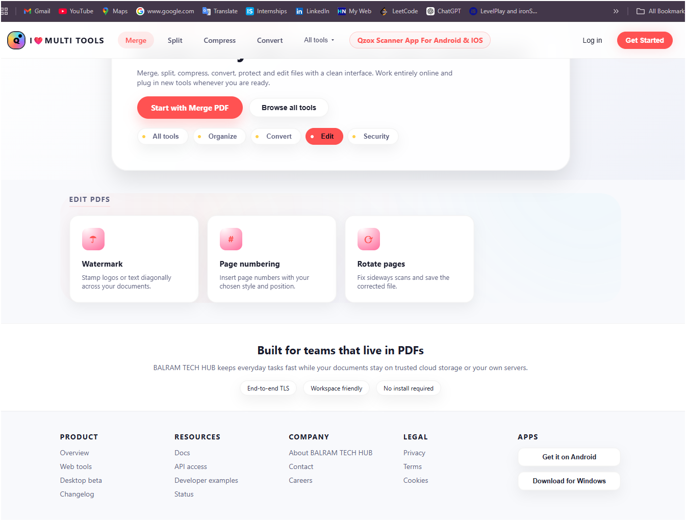

# 📄 PDFCraft – Smart PDF Tools Web App

## 🚀 Overview

PDFCraft is a **modern web-based PDF tool platform** that allows users to perform multiple PDF operations in one place.
It is built using **HTML, CSS, and JavaScript for the frontend**, with a **Node.js backend deployed on Render**.

The platform provides a clean UI and powerful features like merging, splitting, compressing, and converting PDFs directly in the browser.

---

## 🌐 Live Demo

👉 [(https://ilovemultitool.netlify.app/)]
👉 Backend hosted on Render

---

## 🏗️ Tech Stack

### 🎨 Frontend

* HTML5
* CSS3 (Modern UI Design)
* JavaScript (Vanilla JS)
* Responsive Design

### ⚙️ Backend

* Node.js
* Express.js
* REST API
* File Handling (PDF processing)
* Deployed on Render

---

## ✨ Features

### 📂 PDF Operations

* Merge multiple PDFs into one
* Split PDF into multiple files
* Compress PDF size
* Convert images to PDF

### 📝 Editing Tools

* Add watermark
* Page numbering
* Rotate pages

### 🔐 Security Tools

* Add password protection
* Remove password
* Secure PDF copy

### 🧠 Smart UI

* Clean dashboard interface
* Categorized tools (Organize, Convert, Edit, Security)
* Easy navigation and fast performance

---

## 📸 Screenshots

### 🏠 Home Dashboard



### 📂 PDF Tools Section



### ✏️ Editing Features



### 🔐 Security Features


---

## 📂 Project Structure

```id="f9x2la"
controllers/
routes/
services/
uploads/
utils/
server.js
package.json
Dockerfile
```

---

## ⚙️ Installation & Setup

### 1️⃣ Clone Repository

```bash id="2md1v1"
git clone https://github.com/your-username/pdfcraft.git
cd pdfcraft
```

### 2️⃣ Install Dependencies

```bash id="m8gh2x"
npm install
```

### 3️⃣ Run Backend

```bash id="q1sl9p"
node server.js
```

---

## ☁️ Deployment

### Backend

* Hosted on **Render**
* Scalable and reliable cloud hosting

### Frontend

* Can be deployed on:

  * Netlify
  * Vercel
  * GitHub Pages

---

## 🔥 Future Improvements

* Drag & Drop file upload
* Real-time progress indicators
* User authentication system
* Cloud storage integration
* AI-based PDF summarization

---

## 👨‍💻 Author

Balram Singh

---

## ⭐ Note

This project demonstrates full-stack development using **Frontend + Backend + Deployment**, making it suitable for real-world SaaS applications.
